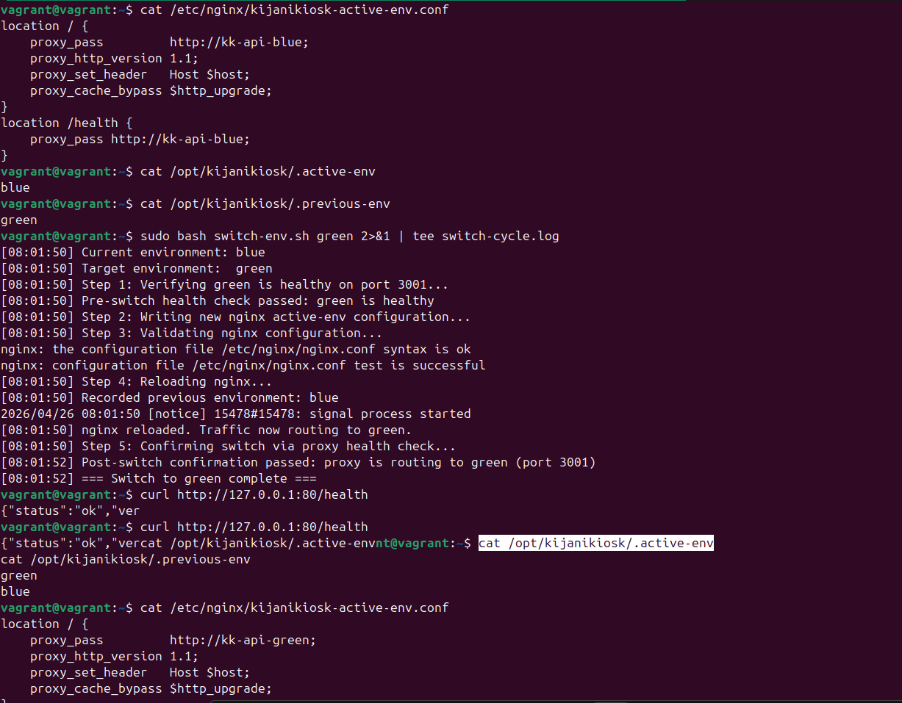
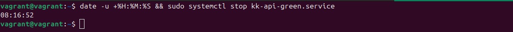
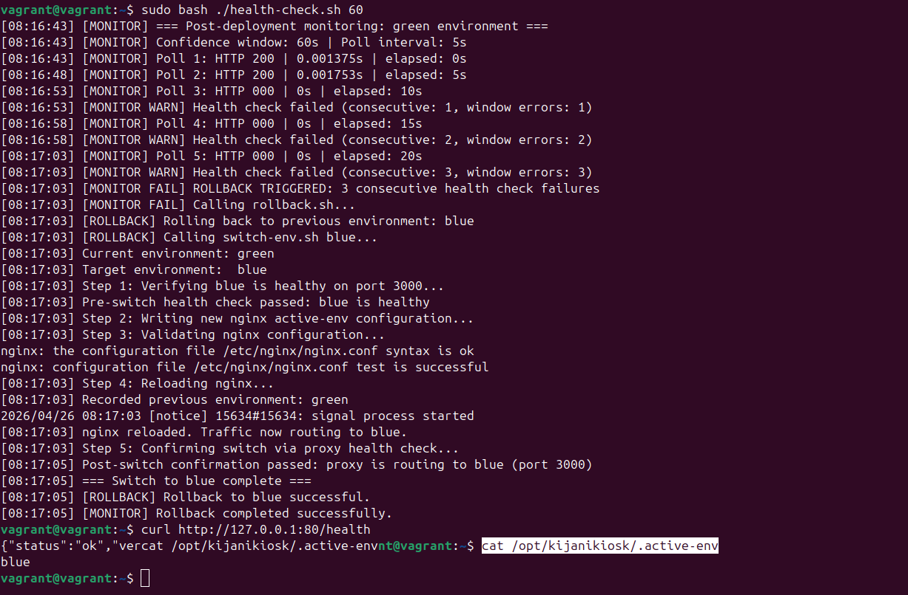
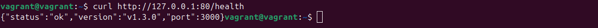
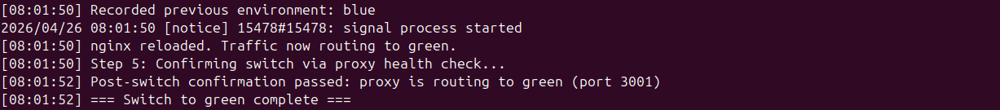

## Evidence Summary

This evidence shows a complete automated health-check and rollback sequence. The monitor started before the fault, captured the service failure, and triggered rollback without human intervention.

**NB: Here i opted for Screenshots rather than text for good Visiblity and prevent me failing to copying certain logs**

## Before Fault was Introduced ACTIVESERVICE = Green

## Fault Injection

## Rollback Triggered after experiencing 3 consecutive health-check failures.

## Version Confirmation 

## Post-Switch Proof

## Verified Timeline

| Marker | Timestamp | Event |
| --- | --- | --- |
| T0 | 08:16:43 | Post-deployment monitoring started for the green environment |
| T1 | 08:16:52 | Green service was intentionally stopped with `sudo systemctl stop kk-api-green.service` |
| T2 | 08:17:05 | Rollback completed successfully and traffic returned to the blue environment |

## Duration

- Total duration from **T0 to T2: 22 seconds**
- Duration **from T1 to T2: 13 seconds**
- Result: the rollback finished well under the **90-second limit**

## What The Log Shows

- The monitor was already running before the fault was introduced.
- There was no human action between fault introduction and rollback confirmation.
- The rollback was triggered automatically after 3 consecutive health-check failures.
- The full sequence is captured in the monitor log, including the failed polls and the successful switch back to blue.

## Key Log Events

- `08:16:43` - monitor started and poll 1 returned HTTP 200
- `08:16:48` - poll 2 returned HTTP 200
- `08:16:53` - poll 3 returned HTTP 000 and failure count began
- `08:16:58` - poll 4 returned HTTP 000
- `08:17:03` - poll 5 returned HTTP 000, rollback triggered automatically
- `08:17:03` - rollback process switched traffic back to blue
- `08:17:05` - post-switch confirmation passed and rollback completed successfully

## Final State

- Active environment: blue
- Previous environment: green
- Health check response after rollback: `{"status":"ok","version":"v1.3.0"}`

